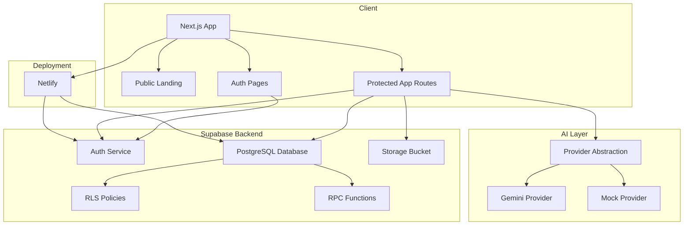
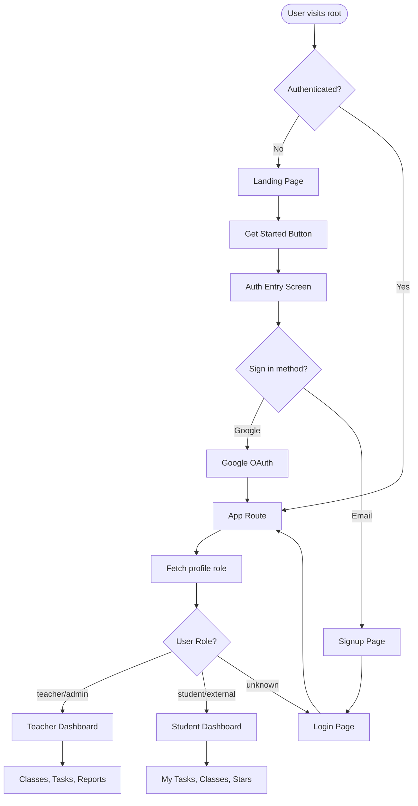
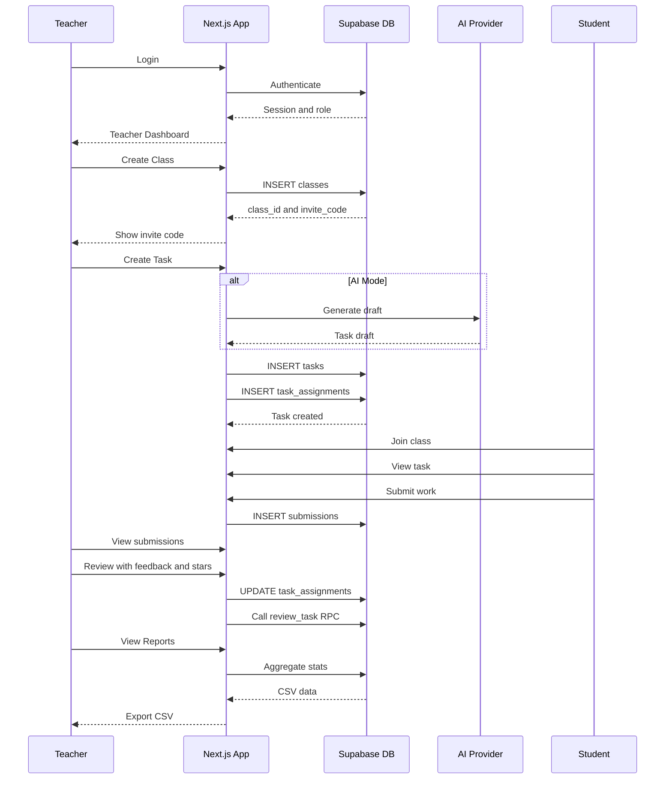
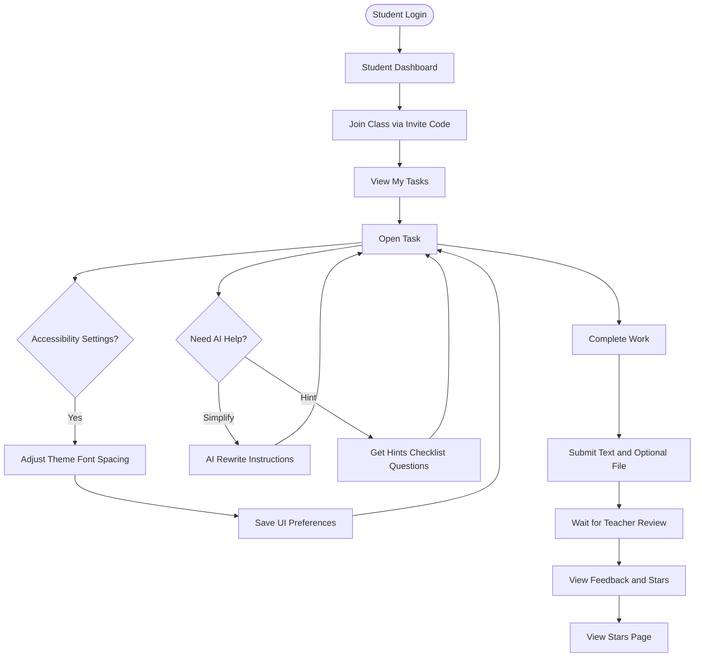

# Dottinoo - Mermaid Diagrams

**Status:** Reference  
**Last Updated:** 2026-01-25  
**Purpose:** System architecture, authentication flow, and teacher/student flow diagrams using Mermaid syntax.

---

# Dottinoo - Mermaid Diagrams

## PART 1 — MERMAID DIAGRAMS

### 1. System Architecture (High Level)

### 2. Auth + Role Routing Flow

### 3. Teacher Flow (End-to-End)

### 4. Student Flow (End-to-End)

